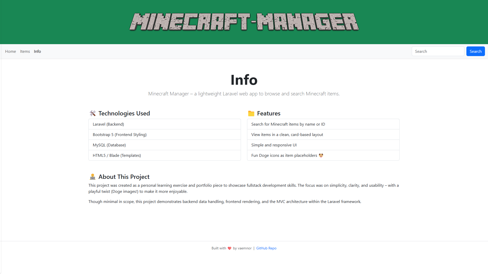

# About Minecraft Manager
Minecraft Manager is a lightweight Laravel-based web application that lets you browse and search Minecraft items easily by name or ID.

## 🚀 Features
- 🔎 **Powerful Search** – Find Minecraft items by name or item ID
- 🧱 **Minimal Item Database** – Displays names and IDs of items
- 🎨 **Simple UI** – Built with Bootstrap 5
- 🐶 **Fun Icons** – Doge meme image used as placeholder icons

## 🛠️ Tech Stack
- **Backend:** [Laravel 12](https://laravel.com)
- **Frontend:** [Bootstrap 5](https://getbootstrap.com)
- **Database:** MySQL
- **Templating:** Blade
- **Other:** HTML5, PHP 8+



## 🧰 Requirements
Before you begin, make sure you have the following installed:

- [PHP 8.1+](https://www.php.net/downloads)
- [Composer](https://getcomposer.org)
- [MySQL Server](https://dev.mysql.com/downloads/mysql/) (or a bundled package like [XAMPP](https://www.apachefriends.org/index.html))
- (Optional) [Git](https://git-scm.com/downloads) to clone the repository

## ⚙️ Installation (Step-by-Step)
Follow these steps to get the Minecraft Manager Laravel app running on your local machine:

### 1. Install Required Software
Ensure you have PHP 8.1+, Composer, and a MySQL database server installed and running.

### 2. Clone the Repository
```
https://github.com/vaemnor/MinecraftManager.git
```

### 3. Install PHP Dependencies
```
composer install
```

### 4. Import the Database to MySQL
The database can be found in `MinecraftManager/minecraftmanager.sql`

### 5. Configure Database
Open .env and update the database credentials:
```
DB_CONNECTION=mysql
DB_HOST=127.0.0.1
DB_PORT=3306
DB_DATABASE=minecraftmanager
DB_USERNAME=root
DB_PASSWORD=
```

### 6. Start the Development Server
```
php artisan serve
```
Visit http://127.0.0.1:8000 in your browser. Make sure the MySQL server is running.
